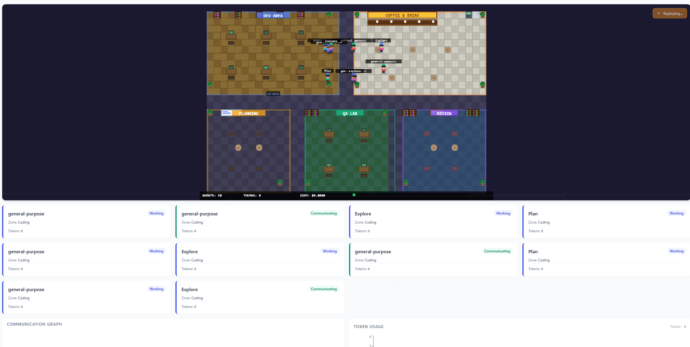
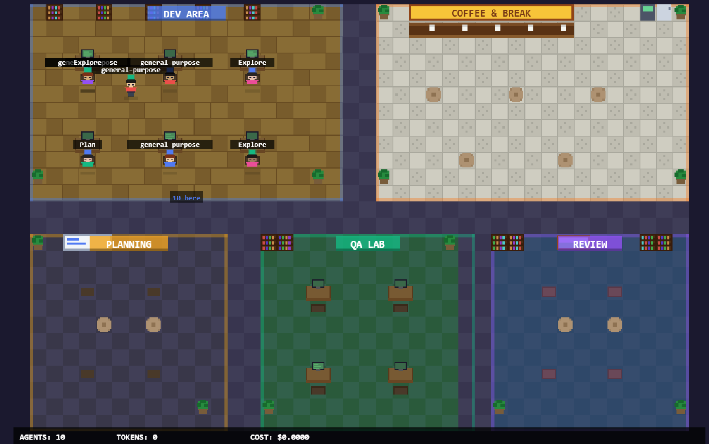
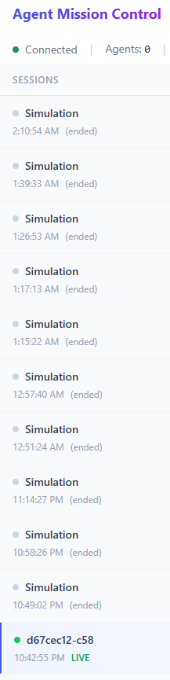

# Agent Mission Control

Real-time visualization and telemetry dashboard for AI coding agents. Watch your Claude Code sessions come alive as pixel-art characters working in a virtual office — coding, reviewing, planning, communicating, and taking coffee breaks.



## What It Does

Agent Mission Control captures telemetry from Claude Code sessions via hooks, normalizes events into a canonical format, persists them to a database, and broadcasts them in real-time to a web dashboard featuring:

- **Pixel-art office visualization** — Agents appear as characters sitting at desks in themed rooms (Dev Area, QA Lab, Planning, Review, Coffee Shop)
- **Real-time event streaming** — Watch tool calls, file edits, and agent communication as they happen
- **Speech bubbles** — See what each agent is doing right now (editing files, running bash, reading code)
- **Fired agents** — Agents that fail float to "Agent Heaven" with halos and angel wings
- **Session replay** — Replay any past session and watch the timeline unfold
- **Scrum board** — Board, Log, Retro, and Metrics tabs for sprint-style tracking
- **Clickable agents** — Click any character to see their status, zone, and recent activity
- **Multi-session support** — Switch between active and historical sessions
- **Sub-agent hierarchy** — See parent-child relationships between agents with visual connection lines
- **Human interaction alerts** — Blocked agents show a "?" badge when they need human input



## Architecture

```
Claude Code Hooks (HTTP POST)
    |
    v
Telemetry Bridge (Fastify, port 4700)
    |--- SQLite Database (persistence)
    |--- WebSocket (real-time broadcast)
    v
Web Dashboard (Next.js, port 3700)
    |--- Event Engine (state management)
    |--- Pixel Art Canvas (visualization)
    |--- Scrum Panel (project tracking)
```

### Packages

| Package | Description |
|---------|-------------|
| `packages/shared` | Event schemas (Zod), TypeScript types, WebSocket protocol |
| `packages/telemetry-bridge` | Fastify API server, SQLite storage, WebSocket broadcaster |
| `packages/simulation-engine` | World state management, event reducers, zone layout, replay |
| `apps/web` | Next.js dashboard with pixel art office and analytics |

## Quick Start

### Prerequisites

- **Node.js** 18+ (tested with 20.x)
- **npm** 9+ (comes with Node.js)
- **Claude Code** CLI installed and working

### 1. Clone and install

```bash
git clone https://github.com/glglak/agent-mission-control.git
cd agent-mission-control
npm install
```

### 2. Start the dev server

```bash
npm run dev
```

This starts both the telemetry bridge (port 4700) and the web dashboard (port 3700).

Alternatively, start them separately:

**Terminal 1 — Telemetry Bridge:**
```bash
cd packages/telemetry-bridge
npx tsx src/index.ts
```

**Terminal 2 — Web Dashboard:**
```bash
cd apps/web
npx next dev --port 3700
```

Then open **http://localhost:3700** in your browser.

### 3. Configure Claude Code hooks

Add the AMC telemetry hooks to your Claude Code configuration. Edit `~/.claude/settings.json` and merge in the hooks:

```json
{
  "hooks": {
    "SessionStart": [
      {
        "hooks": [
          {
            "type": "http",
            "url": "http://localhost:4700/api/collect/claude-code",
            "timeout": 5
          }
        ]
      }
    ],
    "SessionEnd": [
      {
        "hooks": [
          {
            "type": "http",
            "url": "http://localhost:4700/api/collect/claude-code",
            "timeout": 5
          }
        ]
      }
    ],
    "PreToolUse": [
      {
        "hooks": [
          {
            "type": "http",
            "url": "http://localhost:4700/api/collect/claude-code",
            "timeout": 5
          }
        ]
      }
    ],
    "PostToolUse": [
      {
        "hooks": [
          {
            "type": "http",
            "url": "http://localhost:4700/api/collect/claude-code",
            "timeout": 5
          }
        ]
      }
    ],
    "PostToolUseFailure": [
      {
        "hooks": [
          {
            "type": "http",
            "url": "http://localhost:4700/api/collect/claude-code",
            "timeout": 5
          }
        ]
      }
    ],
    "SubagentStart": [
      {
        "hooks": [
          {
            "type": "http",
            "url": "http://localhost:4700/api/collect/claude-code",
            "timeout": 5
          }
        ]
      }
    ],
    "SubagentStop": [
      {
        "hooks": [
          {
            "type": "http",
            "url": "http://localhost:4700/api/collect/claude-code",
            "timeout": 5
          }
        ]
      }
    ],
    "Stop": [
      {
        "hooks": [
          {
            "type": "http",
            "url": "http://localhost:4700/api/collect/claude-code",
            "timeout": 5
          }
        ]
      }
    ],
    "Notification": [
      {
        "hooks": [
          {
            "type": "http",
            "url": "http://localhost:4700/api/collect/claude-code",
            "timeout": 5
          }
        ]
      }
    ],
    "TaskCompleted": [
      {
        "hooks": [
          {
            "type": "http",
            "url": "http://localhost:4700/api/collect/claude-code",
            "timeout": 5
          }
        ]
      }
    ]
  }
}
```

> **Note:** If you already have hooks in your settings.json, merge the `hooks` objects together. The full reference config is also available at `tools/hooks-config.json`.

> **Important:** Hooks are loaded when a Claude Code session starts. You must **start a new session** after saving settings.json for hooks to take effect.

### 4. Verify it works

1. Confirm the bridge is healthy:
   ```bash
   curl http://localhost:4700/api/health
   ```

2. Start a new Claude Code session in any project:
   ```bash
   claude
   ```

3. Open **http://localhost:3700** — you should see the session appear in the sidebar with a green LIVE indicator.

4. Ask Claude to do something (read a file, write code). Events should stream into the dashboard in real-time.



## Dashboard Features

### Views

Toggle between views using the buttons in the header:

| View | Description |
|------|-------------|
| **3D** | Full-screen pixel art office visualization |
| **Dashboard** | Agent cards, communication graph, file activity, event log |
| **Split** | Both views stacked |

### Pixel Office

- **Click an agent** to see their tooltip: name, status, zone, recent activity
- **Speech bubbles** show what agents are doing in real-time (tool calls, messages, results)
- **Replay button** (top-right) appears for ended sessions — replays events progressively
- **Bottom HUD** shows total agent count, active/blocked counts, and live indicator
- **Room labels** identify each zone (Dev Area, Coffee Shop, QA Lab, Planning, Review)
- **Connection beams** show agent-to-agent communication with animated particles
- **Sub-agent lines** show parent-child hierarchy between spawned agents
- **Fired agents** float to "Agent Heaven" at the top with halos and angel wings
- **Human interaction badges** appear as "?" when agents are blocked and need input

### Scrum Panel

The right sidebar provides sprint-style tracking with four tabs:

| Tab | Description |
|-----|-------------|
| **Board** | Kanban-style board showing agent tasks and status |
| **Log** | Chronological message log with categorized entries |
| **Retro** | Retrospective items from agent communications |
| **Metrics** | Agents, tool calls, files touched, completion stats |

### Session Sidebar

- Sessions auto-detected and auto-selected when they appear
- Green pulsing dot = LIVE session
- Gray dot = ended session
- Project path shown below session name

## Try the Demo Simulation

Want to see the dashboard in action without a live Claude Code session? Run the built-in simulation:

```bash
npx tsx tools/scripts/simulate.ts           # Real-time pacing (~60 seconds)
npx tsx tools/scripts/simulate.ts --fast    # Quick run (~15 seconds)
```

Additional simulations:
```bash
npx tsx tools/scripts/simulate-scrum.ts       # Full Scrum sprint with ceremonies
npx tsx tools/scripts/simulate-cinematic.ts   # Cinematic demo for recordings
```

## API Reference

The telemetry bridge exposes a REST API:

| Endpoint | Method | Description |
|----------|--------|-------------|
| `/api/health` | GET | Server status and uptime |
| `/api/sessions` | GET | List all sessions |
| `/api/sessions/:id` | GET | Get a single session |
| `/api/agents?session_id=X` | GET | Agents for a session |
| `/api/events?session_id=X&type=Y&limit=N` | GET | Query events with filters |
| `/api/collect/claude-code` | POST | Ingest hook data |
| `/ws` | WebSocket | Real-time event stream |

## Configuration

Environment variables for the telemetry bridge:

| Variable | Default | Description |
|----------|---------|-------------|
| `PORT` | `4700` | HTTP server port |
| `DB_PATH` | `./amc.db` | SQLite database file path |
| `WS_PATH` | `/ws` | WebSocket endpoint path |

## Team / Multi-Developer Setup

For a shared team dashboard:

1. **Deploy the bridge** to a shared server accessible to all developers
2. **Update hook URLs** in each developer's `~/.claude/settings.json` to point to the shared server (e.g., `http://amc.internal:4700/api/collect/claude-code`)
3. **Deploy the web dashboard** — either on the same server or separately, configured to connect to the bridge
4. Each developer's sessions appear automatically with their project path visible

For user identification, you can wrap the hook with a script that adds a `user_id` field, or identify developers by their session metadata (project path, machine name).

## Project Structure

```
agent-mission-control/
  apps/
    web/                    # Next.js dashboard (port 3700)
      src/
        app/                # Pages
        components/         # UI components
          visualization/    # Pixel office, 3D scene
          dashboard/        # Cards, session list, scrum panel
          graphs/           # Communication graph, file activity
          inspectors/       # Agent inspector, event log
          timeline/         # Timeline bar
        hooks/              # useWebSocket, useSimulation
        stores/             # Zustand state management
  packages/
    shared/                 # Event types, Zod schemas, protocol
    simulation-engine/      # World state, reducers, zones, replay
    telemetry-bridge/       # Fastify server, SQLite, WebSocket
  tools/
    hooks-config.json       # Reference hook configuration
    scripts/
      dev.sh                # Start both services
      simulate.ts           # Demo simulation (10 agents)
      simulate-scrum.ts     # Scrum sprint simulation
      simulate-cinematic.ts # Cinematic demo simulation
```

## Troubleshooting

**No sessions appearing?**
- Check the bridge is running: `curl http://localhost:4700/api/health`
- Verify hooks are in `~/.claude/settings.json`
- Start a **new** Claude Code session (hooks load at startup)

**Events not showing in dashboard?**
- Check browser console for WebSocket connection errors
- Ensure both bridge (4700) and web (3700) are running
- Try selecting the session in the sidebar

**Build errors?**
- Run `npm install` from the root
- Make sure Node.js 18+ is installed
- Run `npm run build` to build all packages

**Database issues?**
- Delete `amc.db`, `amc.db-wal`, `amc.db-shm` and restart the bridge (creates fresh DB)

## License

MIT
